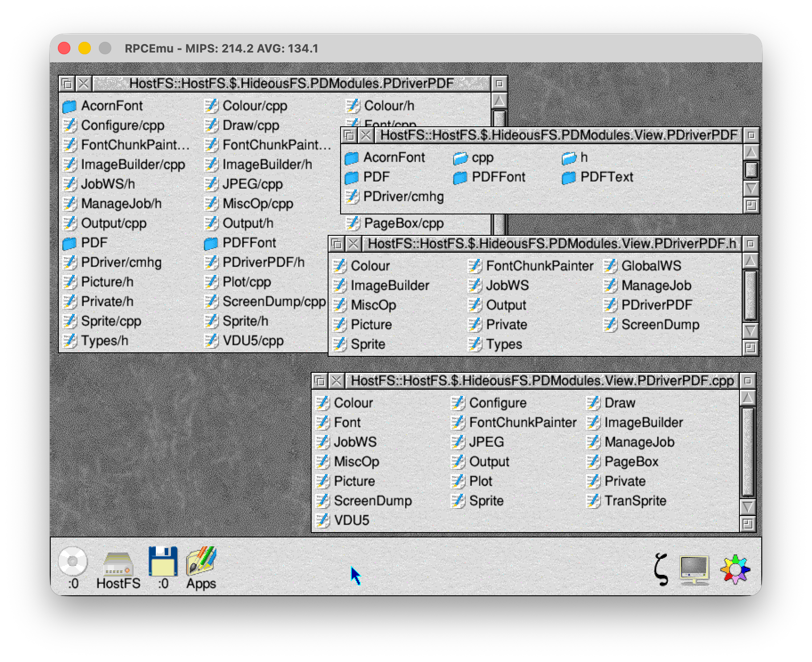

# HideousFS

HideousFS is a family of projection filesystems that present transformed views
of source directories.

It is intended for source trees that need to be comfortable both on RISC OS and on Unix-like systems. Unix and GitHub prefer names such as `leaf.c`; RISC OS source conventions often use names such as `c.leaf`. HideousFS lets one layout be viewed as the other.

## Image file

A HideousFS image file is a small configuration file placed inside the directory to be viewed. The file data are not stored inside the image file; the real files remain in the surrounding directory.

The example name is usually:

```text
View
```

but the leafname is arbitrary. HideousFS should identify the image by filetype, not by name.

During development the image filetype is:

```text
&001
```

This is a temporary user-area filetype and may clash with existing uses such as music files.



## Hideous mode

Hideous mode is for Unix/GitHub-friendly backing stores.

Backing directory as seen through HostFS:

```text
leaf/c
leaf/h
Readme
```

The same files are typically seen from Unix as:

```text
leaf.c
leaf.h
Readme
```

HideousFS presents them to RISC OS as:

```text
c.leaf
h.leaf
Readme
```

## Beautiful mode

Beautiful mode is the reverse view.

Backing directory:

```text
c.leaf
h.leaf
Readme
```

HideousFS presents:

```text
leaf/c
leaf/h
Readme
```

This is mainly useful for conversion. Copying files out of a Beautiful-mode view can produce a Unix-friendly layout.

## FUSE build

The FUSE product builds a Unix/macOS binary using `pkg-config fuse3`:

```sh
make fuse
```

Mount a Unix backing directory with:

```sh
build/hideousfs-fuse [options] <backing-directory> <mount-point>
```

Useful options:

```text
--config=FILE
--extension=directory|suffix|pass
--filetypes=pass|suffix|xattr
--reverse=c,h,a,cpp,c++,o,s
--ignore=NAME
--virtualdir=c,h,o
--foreground
--readonly
--debug
```

`extension=directory` presents backing names such as `leaf.c` as `c/leaf`.
`extension=suffix` presents backing names such as `c/leaf` as `leaf.c`.
`extension=pass` leaves leaf names unchanged.

`filetypes=pass` leaves RISC OS metadata where it is. `filetypes=suffix`
presents `user.RISC_OS.LoadExec` metadata as comma suffixes where possible.
`filetypes=xattr` presents recognised comma suffixes such as `,ffa` and
`,0-741829fc` as `user.RISC_OS.LoadExec`.

Run the live FUSE smoke tests with:

```sh
make fuse-test
```

## Example configuration

```text
# HideousFS
extension directory
filetypes pass
reverse c h s o a cpp c++
ignore View
ignore .git
virtualdir c h o
```

For the reverse view:

```text
# HideousFS
extension suffix
filetypes pass
reverse c h s o a cpp c++
ignore View
ignore .git
```

## Status

HideousFS is experimental. The RISC OS image filing system and the FUSE product
are both early implementations. The FUSE binary currently supports read/write
projection for `extension=directory`, `extension=suffix`, and `extension=pass`,
with `filetypes=pass`, `filetypes=suffix`, and `filetypes=xattr` metadata
presentation.
